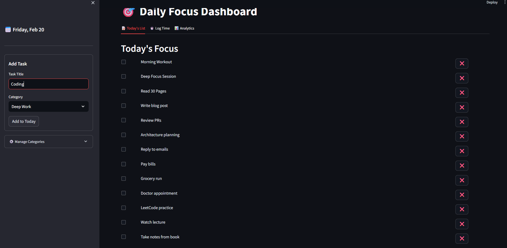
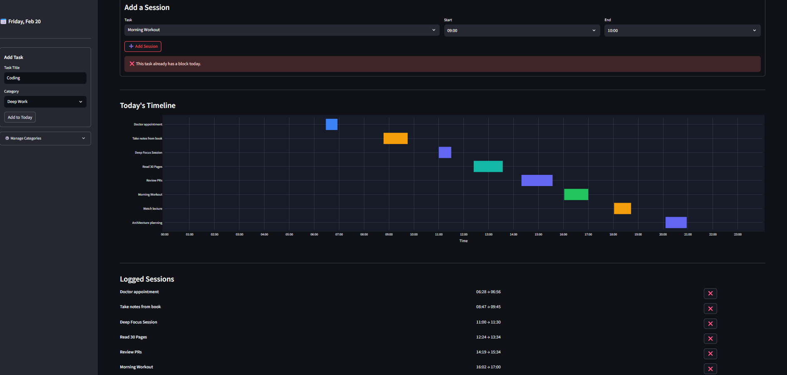
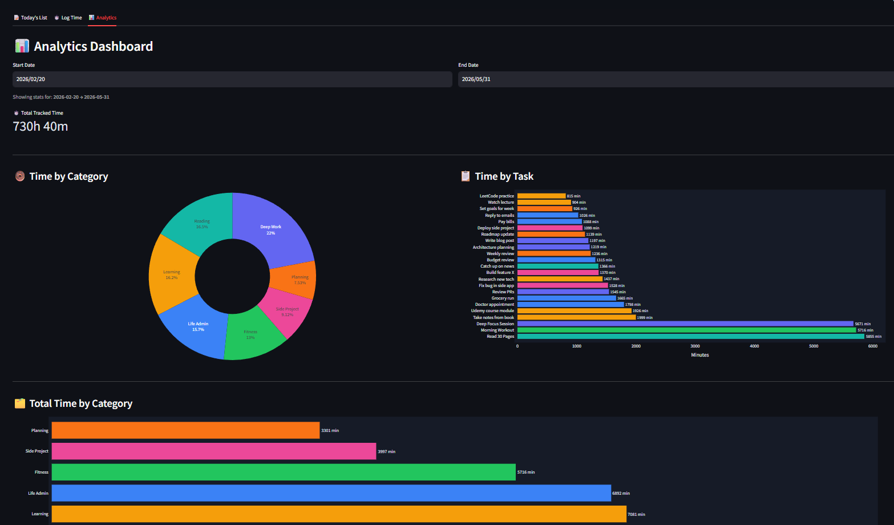
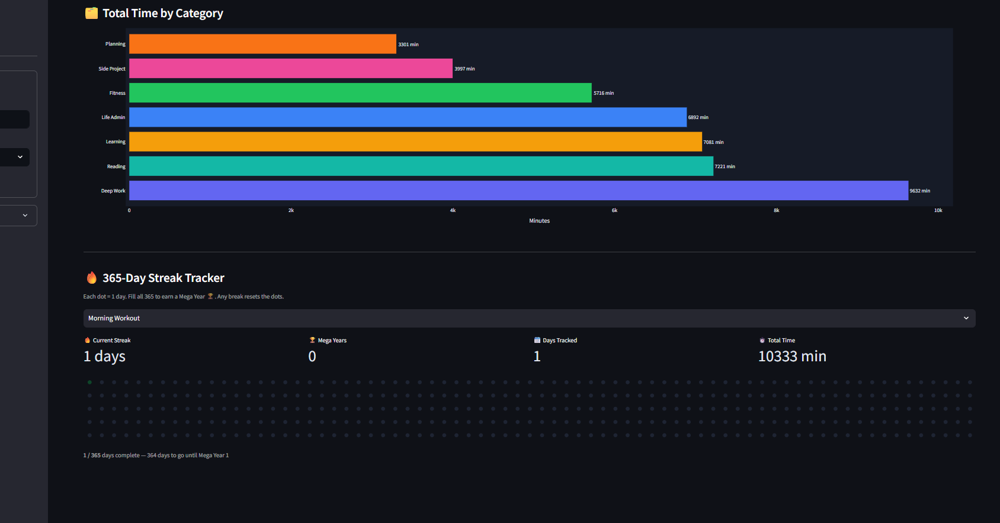

#  Daily Focus Time Tracker

Daily Focus is a professional, full-stack time tracking application designed to help you organize your day, track habits, and visualize your productivity. 

Built with a high-performance **FastAPI** backend and a sleek **Streamlit** frontend, it leverages a robust **PostgreSQL** database to manage your tasks and time blocks with precision.

---
## ScreenShots








##  Features

- **Task Management**: Create, update, and organize tasks with specific categories.
- **Time Blocking**: Log precise time intervals for each task, ensuring no overlapping slots.
- **Category Organization**: Group your work into vibrant, color-coded categories (Deep Work, Fitness, Learning, etc.).
- **Analytics Dashboard**: Visualize your progress with intuitive charts and statistics.
- **Habit Tracking**: Maintain streaks for your core daily routines.

---

## Tech Stack

- **Backend**: Python 3.11, [FastAPI](https://fastapi.tiangolo.com/), [SQLModel](https://sqlmodel.tiangolo.com/) (SQLAlchemy + Pydantic).
- **Frontend**: [Streamlit](https://streamlit.io/).
- **Database**: [PostgreSQL](https://www.postgresql.org/) 15.
- **Containerization**: [Docker](https://www.docker.com/), Docker Compose.

---

## Getting Started (Docker)

The easiest way to get the application running is using Docker Compose.

### Prerequisites

- [Docker Desktop](https://www.docker.com/products/docker-desktop/) installed and running.
- [Docker Compose](https://docs.docker.com/compose/install/) (standard with Docker Desktop).

### ⚙️ Installation & Setup

1. **Clone the Repository** (if you haven't already):
   ```bash
   git clone <repository-url>
   cd daily_focus_backend
   ```

2. **Start the Application**:
   **Option A (Automated)**: Run the provided batch script to build, launch in the background, and automatically open your browser.
   ```cmd
   .\start_tracker.bat
   ```
   **Option B (Manual)**: Run the following command to build and launch all services in your terminal:
   ```bash
   docker-compose up --build
   ```

3. **Access the Application**:
   - **Frontend UI**: [http://localhost:8501](http://localhost:8501) (Option A opens this automatically)
   - **Backend API (Docs)**: [http://localhost:8000/docs](http://localhost:8000/docs)

---

## Getting Started (Standalone / Windows)

If you prefer to run the application without Docker, you can use the provided PowerShell scripts to run the services natively on your Windows machine using SQLite.

### Prerequisites

- **Python 3.10+** installed and added to your system `PATH`.

### ⚙️ Installation & Setup

1. **Clone the Repository** (if you haven't already):
   ```powershell
   git clone <repository-url>
   cd daily_focus_backend
   ```

2. **Install Dependencies**:
   Run the setup script. This will automatically create a local virtual environment (`.venv`) and install all necessary backend and frontend requirements.
   ```powershell
   .\setup_standalone.ps1
   ```

3. **Start the Application**:
   Run the launch script. This starts both the FastAPI backend and Streamlit frontend in the background.
   ```powershell
   .\run_standalone.ps1
   ```
   - **Frontend UI**: [http://localhost:8501](http://localhost:8501) (will open automatically)
   - *Note: A local SQLite database (`daily_focus.db`) will be created automatically in your repository folder.*

4. **Stop the Application**:
   To gracefully shut down the background services when you are finished:
   ```powershell
   .\stop_standalone.ps1
   ```

---

## Seeding the Database

To quickly populate the application with 6 months of demo data for testing and visualization:

```bash
docker exec daily_focus_backend python -m app.seed
```

This will purge the existing database and generate approximately 1,300+ time blocks across categories like "Deep Work", "Learning", and "Fitness".

---

## Project Structure

```text
.
├── app/                # FastAPI Backend Application
│   ├── models.py       # SQLModel database schemas
│   ├── routers/        # API endpoints (tasks, analytics, categories)
│   ├── seed.py         # Dummy data generator
│   └── main.py         # Application entry point
├── frontend/           # Streamlit Frontend Application
│   └── frontend.py     # Main UI logic
├── docker-compose.yml  # Docker orchestration configuration
└── Dockerfile          # Backend container definition
```

---

